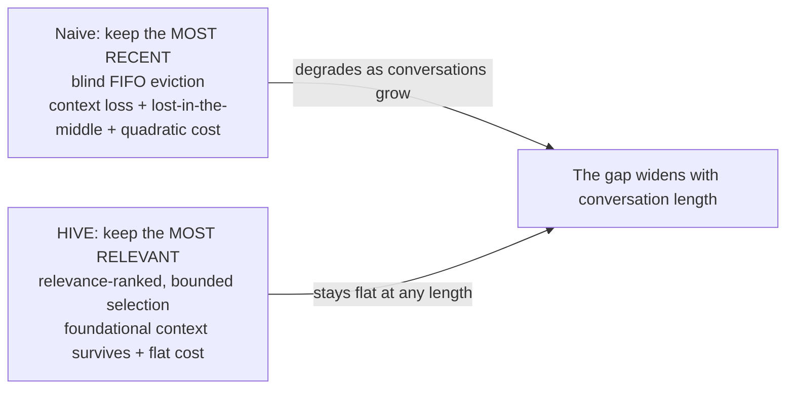
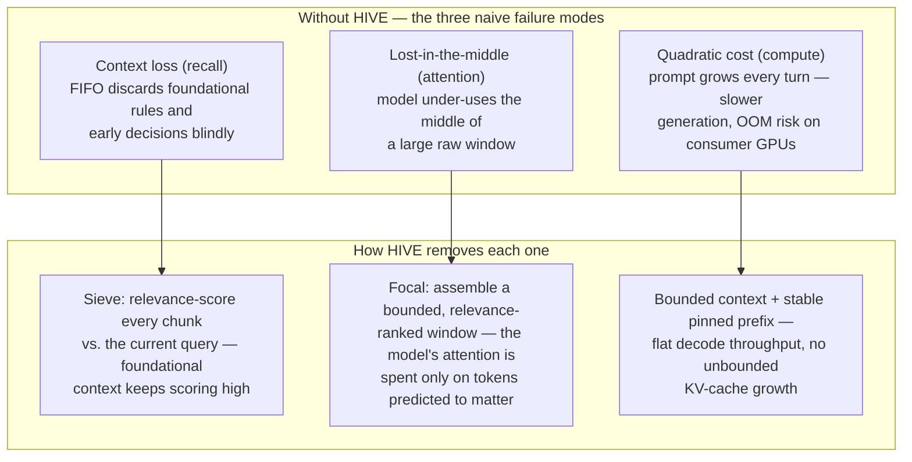
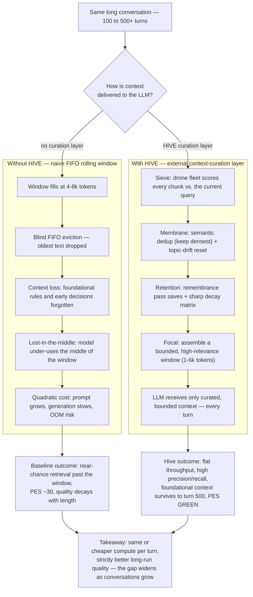
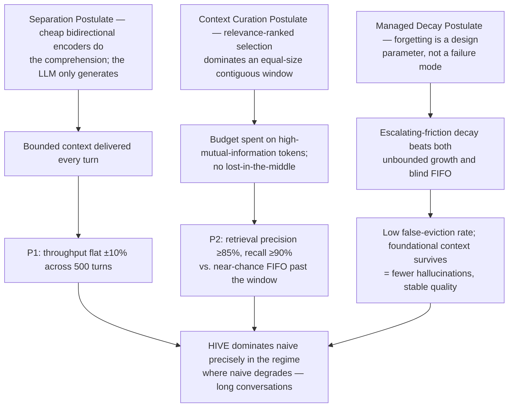
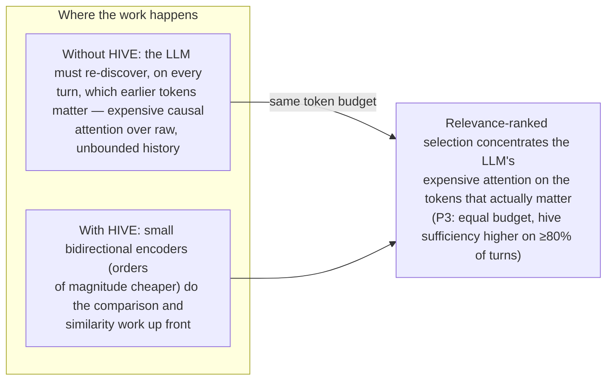
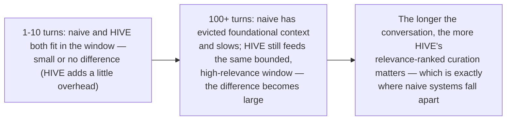

# Hive Memory — Why HIVE Improves Over Not Using HIVE

Companion to `HIVE-WHITE-PAPER.md`, `HIVE-MEMORY-PLAN.md`, `AI-HANDOFF.md`, and `README.md`.
This document answers one question with diagrams:

> **Why does the HIVE system improve results over not using HIVE — and why?**

> Rendering: the diagrams below are Mermaid. Open this file in GitHub, VS Code
> (with "Markdown Preview Mermaid Support"), or Obsidian to render them.

---

## 1. The one-sentence argument

The one-sentence argument: **naive systems keep the *most recent* text; HIVE keeps the
*most relevant* text.** Everything else follows from that distinction.

---

## 2. Why naive fails — and how HIVE removes each failure mode

The white paper identifies three compounding failure modes in long conversations. HIVE exists
because each one is **engineerable away** rather than an irreducible limit.

---

## 3. The comparison — same conversation, two outcomes

---

## 4. Why the mechanism wins — the causal chain

### 4.1 Postulates → outcomes (the logical "why")

### 4.2 Why externalizing comprehension is cheaper and better

HIVE is not "more context" — it is **better allocation of the same compute**.

---

## 5. Why the improvement grows with conversation length

---

> **Bottom line:** HIVE wins because it externalizes the two things a generative model is
> bad at — *remembering* and *selecting* — to components built for them, and spends the
> model's expensive attention budget only on tokens predicted to matter. Naive systems
> degrade on all three axes (recall, attention, compute) as conversations grow; HIVE's
> bounded, relevance-ranked context keeps all three flat.
