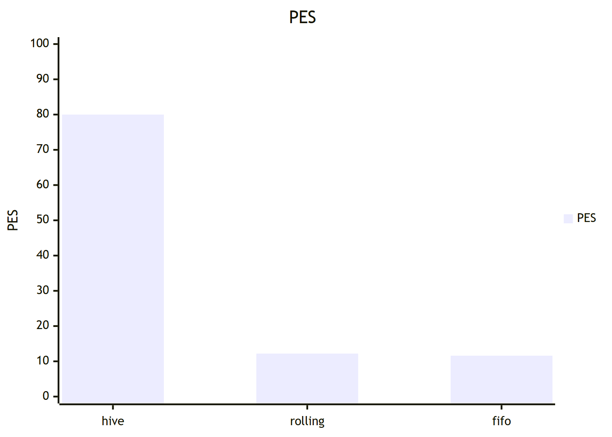
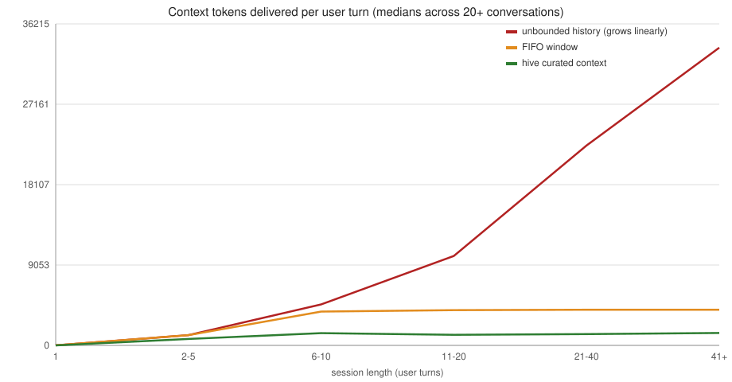

# HiveMemory / HiveBench

[](https://github.com/sky-is-green/hive-memory/actions/workflows/ci.yml)

**HiveMemory** is an external, multi-agent context-curation layer for
long-horizon LLM conversations. It sits between a user and a local LLM backend,
filtering, scoring, compressing, and reassembling conversation history into a
bounded, high-relevance context window for every turn — so a generative model
performs well over arbitrarily long conversations on consumer hardware.

**HiveBench** is its evaluation suite: unit/integration/benchmark tests, a live
benchmark harness, and the white paper's falsifiable predictions
([P1–P11](HIVE-WHITE-PAPER.md#5-hypotheses-and-predictions)) with measured
verdicts.

## Why Hive

The core idea is the white paper's *Separation Postulate*: small bidirectional
"drone" encoders (fast, cheap, CPU-friendly) do the *comprehension* — scoring,
filtering, and routing context — while the primary generative LLM does the
*generation*.

**The headline measurement** — same 308+ turn conversations, same model,
hive vs naive FIFO windowing (live run `20260822_211131`):

- **[Hive ≥ FIFO on 85.1% of retrievable turns](HIVE-WHITE-PAPER.md#p3--context-sufficiency-hypothesis) (P3)** —
  the direct head-to-head against the current standard
- **[90.3% of the facts the model stated made it into context](HIVE-WHITE-PAPER.md#p2--retrieval-precision-hypothesis)** (P2) — deterministic
  diagnostic, ≥90% target; FIFO truncates and drops facts at its window
  limit
- **[Flat generation speed across 308+ turns](HIVE-WHITE-PAPER.md#p1--constant-throughput-hypothesis)** (P1) — 14.5 → 15.5 decode tps
  (+6.7%), no context-bloat slowdown
- All at ~3.4 ms assembly + ~15 ms drone scoring overhead per turn



*PES is the system's own pipeline-efficiency score (retrieval/routing/
latency/throughput/utilization) — a health signal, not a measure of answer
quality. The head-to-head evidence above is what the claims rest on.*

**Why Hive is a great addition to LLM use**

- **Bounded cost, always.** The hive caps the context window regardless of
  conversation length (adaptive budget: 1–3k tokens live), so per-turn cost and
  generation time stay flat instead of growing with history. And because KV
  compression is a *precision* axis while curation is a *selection* axis, the
  savings compound rather than compete: paired with a TurboQuant-class KV
  quantizer (~3–4 bits, near-zero loss), a hive-curated context makes a
  50k-token conversation's cache ~150× smaller than raw history — selection
  multiplies precision on the surviving tokens (white paper §1.6).
- **It drops in around your existing backend.** Any OpenAI-compatible endpoint
  (LM Studio, llama.cpp, vLLM, hosted APIs) works — no model retraining, no
  prompt rewrites; the harness exposes it as a drop-in API.
- **Runs on consumer hardware.** The drones are small CPU models (~60 MB,
  ~5 ms/query, no GPU required) — verified on an AMD-only rig with no NVIDIA,
  where FP8-attention paths don't exist (the exact gap TurboQuant-class KV
  quantization fills).
- **The efficiency gap is measured, not claimed:**

| Metric | Hive | Status quo (FIFO/rolling window) |
|---|---|---|
| Pipeline efficiency (PES, flagship live run) | **80.0 GREEN** | 12.2 / 11.6 |
| [Decode speed over 308+ turns](HIVE-WHITE-PAPER.md#p1--constant-throughput-hypothesis) (P1) | **Flat** (14.5→15.5 tps, +6.7%) | Slows as context grows, then truncates |
| [Stated-fact recall](HIVE-WHITE-PAPER.md#p2--retrieval-precision-hypothesis) (P2, deterministic) | **90.3%** | Facts dropped at window limit |
| [Turns where hive ≥ FIFO](HIVE-WHITE-PAPER.md#p3--context-sufficiency-hypothesis) (P3) | **85.1%** | — |
| Paired A/B under window pressure (82 turns, live) | **84.1% overall; 87.5% vs 82.1% late-turn, once the window drops facts** | 84.1% while its window still holds everything |
| Context utilization (p50) | **74.5%** | ~40% (fluff) |
| Added latency per turn | **~18 ms** | 0 (but loses the facts) |
| Stability (500-turn run) | **0 OOM**, peak RSS 34.7 MB | — |

All numbers are the live runs recorded in the white paper's measured-outcome
table (§8); PES is defined in §6. The paired A/B row is the fair-selection
live measurement (bonsai-27b, identical replayed history for both arms,
FIFO window capped at 1500 tokens to force truncation): at parity overall,
with strict hive-only wins outnumbering FIFO-only 14:6 once the naive
window starts dropping facts.



*Median context tokens per user turn across 721 live turns (two run bundles):
the hive delivers a flat ~1.2–1.4k-token window regardless of session length,
while the unbounded history it replaces reaches 33,500+ tokens by turn 40.*

## Why HiveBench

Most evaluation harnesses tell you how a model performs in a sandbox. HiveBench
tells you *whether the context you feed the model is the reason it works* — and
it does it deterministically, offline, and replayably:

- **Falsifiable, not vibes.** The white paper's
  [P1–P11 predictions](HIVE-WHITE-PAPER.md#5-hypotheses-and-predictions) ship as
  executable tests with measured PASS/FAIL verdicts (§8). Every number in this
  README is reproduced by a command in the repo.
- **No LLM-as-judge circularity in the evidence path.** The deterministic
  diagnostics score fact presence against fixture ground truth — stated-facts
  recall, first-mention exclusion, hedge filtering. **The Hive queen** — an
  asynchronous ground-truth layer that labels, after each turn, whether the
  assembled context was actually sufficient for the query — corroborates that
  evidence; because it shares the served model's biases, it never constitutes
  it (§9, Threat 1).
- **The full test suite runs offline in ~30 seconds** — no LLM calls and no API
  keys; CI-friendly via `--mock`. 500+ tests grouped by what they measure
  (`speed`, `intelligence`, `skills`, `maximum`). (Running the system *live*
  does require a local model backend — LM Studio / llama.cpp — which on most
  rigs means a GPU; the drones themselves stay on CPU.)
- **Paired head-to-head A/B** (`hivebench-ab`): the same turns, the same model,
  hive-curated context vs the naive FIFO window — both answers scored
  deterministically (fixture-fact presence + context fidelity), with both
  arms' stores replaying identical history so the comparison isolates
  selection. The scoring path is unit-tested; interim live results are
  recorded per run under `runs/`.
- **Built for long evidence runs.** Checkpointed, resumable live runs survive
  crashes and reboots:

  ```powershell
  .\.venv\Scripts\python -m experiments.paired_ab --live --model prism-ml/bonsai-27b --max-turns 45 --fifo-budget 1500 --checkpoint-every 2 --output runs/paired_ab.json
  # killed mid-run? relaunch with --resume runs/paired_ab_trunc-style checkpoint,
  # or let tools/resume_evidence.ps1 loop until the final report exists.
  ```

  One-command CLIs (`hivebench`, `hivebench-protocol`, `hivebench-diagnostic`,
  …) wrap the rest.
- **Honest by design.** The suite surfaced its own failures first — the
  measurement fixes that made PES trustworthy (latency floor, stated-facts
  reframe, hedge poisoning) are documented in the paper's threats section
  (§9), not hidden.

## Repo layout

| Path | Contents |
|---|---|
| `hive/` | The system: cortex (routing, PES, congestion), sieve (drones), retention, focal (budget/assembly), backend (LM Studio / OpenAI-compat), queen (async ground truth) |
| `hivebench/` | The evaluation suite: `tests/` (grouped runner), `testing/` (A/B, ablation, shadow mode), `experiments/` (live benchmark, protocol, probes) |
| `harness/` | HiveBench Studio sidecar (FastAPI service over the hive) |
| `docs/` | Full-stack install guide + integration guides (OpenCode, dsh, your own harness) |

## Install

Requires Python 3.10+. Pick the layer you need — they install cleanly:

```powershell
# Windows (PowerShell)
python -m venv .venv
.\.venv\Scripts\python -m pip install -e ".[harness,bench]"
```

```bash
# Linux / macOS
python3 -m venv .venv
.venv/bin/python -m pip install -e ".[harness,bench]"
```

| Install target | What you get |
|---|---|
| `pip install hive-memory` | The system: drones, cortex, retention, backends |
| `pip install "hive-memory[harness]"` | + HiveBench Studio (FastAPI sidecar) |
| `pip install "hive-memory[bench]"` | + the evaluation suite (pytest, ST trainer) |

`requirements.txt` / `requirements-dev.txt` remain the full pinned manifest.

## Use the system in your own project

`hive/` is self-contained — it never imports from the bench or the harness:

```python
from hive import Hive, HiveConfig, UltraSmallDrone, LMStudioBackend

hive = Hive(
    config=HiveConfig(),
    ultra=UltraSmallDrone(),
    backend=LMStudioBackend(base_url="http://localhost:1234"),
)
result = hive.process_turn("what did we decide about auth?")
print(result.reply)
```

## Run the studio (HiveBench Studio)

One guided setup, then one command:

```powershell
.\.venv\Scripts\python -m harness --setup   # creates config, checks backend
.\.venv\Scripts\python -m harness           # starts http://127.0.0.1:8765
```

`--setup` copies `providers.example.json` → `providers.local.json` if missing,
probes for a reachable backend (LM Studio on `:1234`, or auto-starts the local
`llama-server` from `models/gguf`), and prints the next step. The studio serves
the hive over a FastAPI API — the endpoint contract lives in
`harness/harness/app.py`, and `docs/INTEGRATE.md` shows how to point external
clients at it.

## Run the test suite

The suite is grouped by what it measures (offline; no LLM required):

```powershell
.\.venv\Scripts\python -m tests.run_hive_tests --group maximum   # full suite (default)
.\.venv\Scripts\python -m tests.run_hive_tests --group speed     # latency/PES
.\.venv\Scripts\python -m tests.run_hive_tests --group intelligence  # retrieval/assembly
.\.venv\Scripts\python -m tests.run_hive_tests --group skills    # pipeline/backends
```

## Try it live

The live benchmark talks to an OpenAI-compatible backend (e.g. LM Studio on
`localhost:1234`). A quick resumable iteration run:

```powershell
.\.venv\Scripts\python -m experiments.generate_data --live --no-thinking --confidence off --max-convs 3 --max-turns 10
```

See `docs/INSTALL.md` for the full setup and run guide, and
`HIVE-WHITE-PAPER.md` §8 for the measured-outcome table behind every claim.

## Documentation

- **`docs/INSTALL.md`** — full-stack install guide (system + benchmark + studio, fresh machine)
- **`docs/INTEGRATE.md`** — using hive-memory inside OpenCode, dsh, or your own harness
- **`HIVE-WHITE-PAPER.md`** — the theory: postulates, falsifiable predictions P1–P11 with measured verdicts (§8), the PES metric (§6), KV-compression landscape (§1.6), threats & limitations (§9)
- **`HIVE-DIAGRAMS.md`** — visuals and measured charts